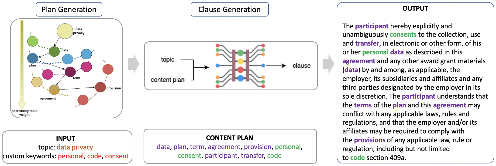

# Graph-based Keyword Planning for Legal Clause Generation from Topics



This repository contains the source code for our paper published at the Natural Legal Language Processing Workshop, EMNLP 2022.  
You can find our published paper [here](https://aclanthology.org/2022.nllp-1.26/).


## About our approach

The goal is to effectively leverage pretrained generative models for legal clause generation: given a small piece of suggestive information about the content of the legal clause, our generative pipeline works to:
1. Produce more content (CONTENT PLAN) from the provided small piece of suggestive clause content (INPUT)
2. Using the augmented content, generate the legal clause (OUTPUT)
In our paper, we discuss the possibility to refine/tailor the generated clause content through iterative application of this pipeline

Our work serves to benchmark the performance of pretrained generative models specific to the area of legal clauses, something that had not seen much attention prior to our work. In the absence of a dataset for the particular task on which we aim to model our problem, we sample the input from the space of legal clause topics in the [LEDGAR](https://aclanthology.org/2020.lrec-1.155/) dataset.

In this repository, we provide the code for dataset creation for our problem from the LEDGAR data, followed by the main experiment components. Hence, prior to getting started with reproducing the results, you first need to have the LEDGAR data downloaded in your working directory. You may obtain the same from [here](https://drive.switch.ch/index.php/s/j9S0GRMAbGZKa1A). Note that we make use of the cleaned corpus from this dataset.


## Reproducing the main results

You'll find the scripts to run inside the ./scripts folder, and code for different components in other folders. Follow this order to prepare the workable subset from the LEDGAR corpus (download the LEDGAR dataset from [here](https://drive.switch.ch/index.php/s/j9S0GRMAbGZKa1A).) We'll be making use of the cleaned corpus.

### Preparing the dataset and vocabular files
`bash ./scripts/run_create_dataset.sh`

### Create and serialize the adjacency matrix to be used for graph creation from extracted and topics in the dataset
`bash ./scripts/run_create_adjacency_matrix.sh`

### This script points to all the keyword to clause generation experiments in the paper:
```
bash ./scripts/run_train_clause_generation.sh
```

### Evaluate clause generation performance post training
```
bash ./scripts/run_evaluate_clause_generation.sh
```
